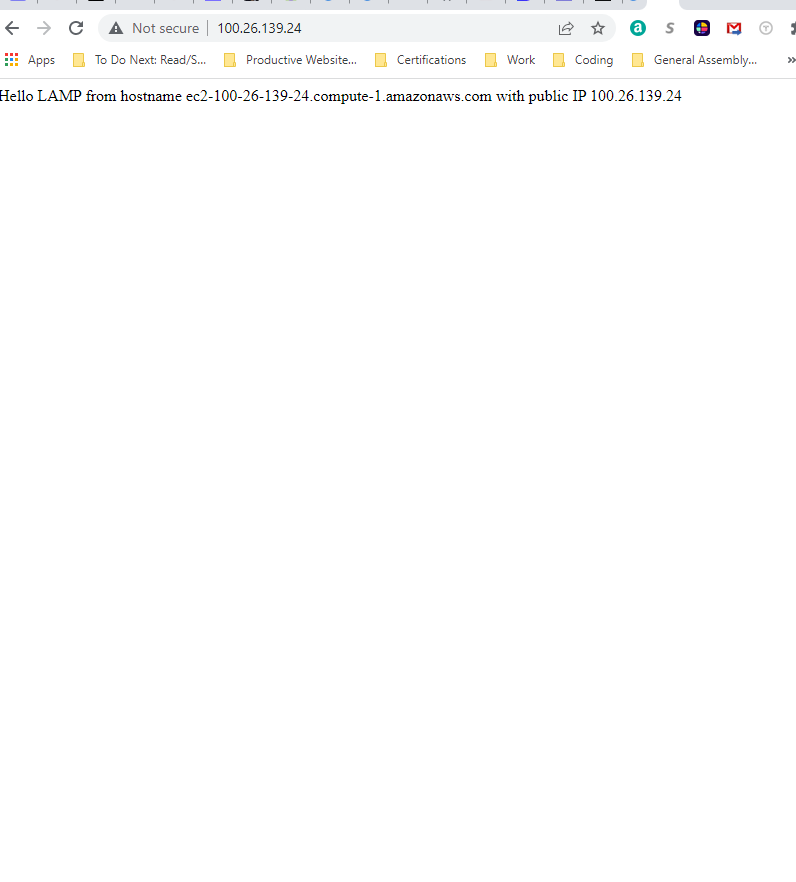

# Documentation of Project 1

## *Installment of Apache & Firewall update*
1. *sudo apt update*
2. *sudo apt install apache2*
3. *sudo systemctl apache2*

------------------
**Retrieve your public IP address, other than to check it in AWS Web console, this command...**
- curl -s http://169.254.169.254/latest/meta-data/public-ipv4
-------------------

## *MySQL Installment*
1. *sudo apt install mysql-server*
2. *sudo mysql*

3. *sudo mysql_secure_installation*
- configured the password to be ~~*PassWord.1*~~
4. *Then logged in to MySQL console*

-------------------------
## PHP Installment
1. *Installed PHP*

----------------------------

## Created Virtual Host

1. *sudo mkdir /var/www/projectlamp*
- created a directory and then assigned ownership
2. *sudo chown -R $USER:$USER /var/www/projectlamp*
3. *created a new blank file*
4. *used vim to insert it, saved and quit*
5. *enabled a virtual host*
- sudo a2ensite projectlamp

6. *Checked website url using IP address*
- ~~100.26.139.24~~

--------------------

## Enabling PHP on the website
1. I changed directory index by editing the dir.conf file

`<IfModule mod_dir.c>

        #Change this:
        #DirectoryIndex index.html index.cgi index.pl index.php index.xhtml index.htm
        #To this:
        DirectoryIndex index.php index.html index.cgi index.pl index.xhtml index.htm
</IfModule>`

2. Reloaded Apache, created PHP test script andn then removed php file after for sensitivity purposes.
